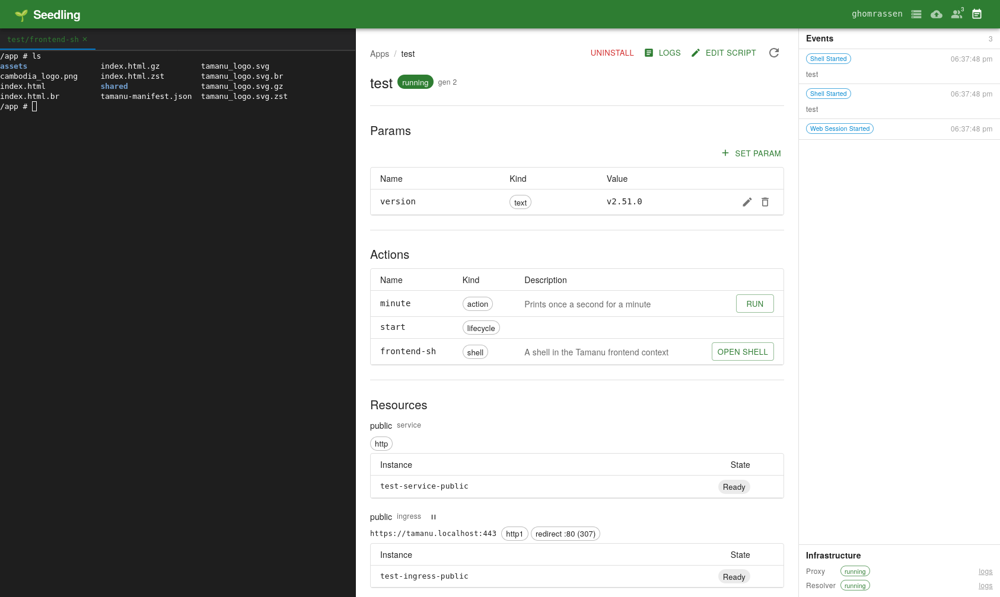

# Seedling

Seedling is a lightweight high-level container app management system.

Lightweight: it's designed to run easily on single servers with few resources, and does not require setting up Kubernetes or complicated networking. You get three binaries and one kernel module ([jool](https://nicmx.github.io/Jool/), for NAT64) — and you don't even need to set up Jool, Seedling does it for you.

High-level: you write app definitions which include high level concerns such as parameters, secret management, HTTPS and certificates, advanced upgrade and maintenance workflows, custom shells, volumes, snapshots, and backups... in a friendly and simple syntax that doesn't make you want to die (ie not YAML). A web UI and full CLI is included.

Container: everything except for Seedling itself (for bootstrapping reasons) is container-based. HTTP traffic routes through Caddy, which is itself containerised. DNS traffic uses CoreDNS, also containerised.

Reasonably good performance: it's Podman containers and almost all the networking is in the kernel. Seedling configures things but otherwise gets out of the way.

Easy to upgrade: your workloads keep running even if Seedling isn't, and won't be torn down when it comes back up. This makes it trivial to upgrade: install the new binary, restart the service. The web UI will reconnect and you probably won't even notice.

## Use it

Status: in production internally, but not an externally supported product.

Documentation is a bit sparse at the moment.

- [App scripting language guide](./docs/bsl-scripting.md)
- [Backup apps](./docs/backup-app.md)
- [Dynamic vs static resources](./docs/resource-context-rules.md)
- [Low-level networking docs](./docs/networking.md)
- [Comprehensive specifications](./docs/spec/)
